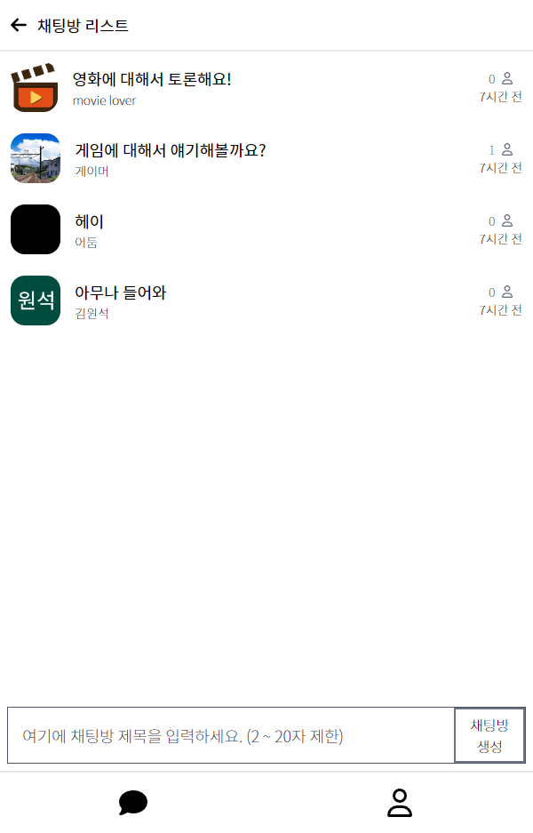
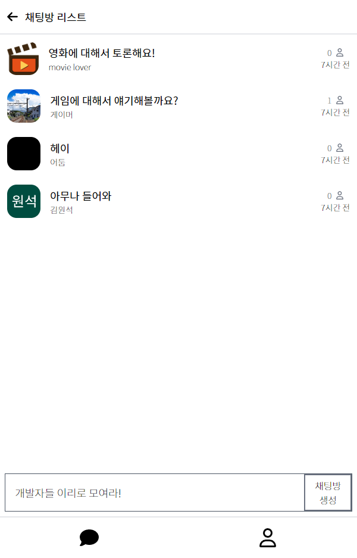
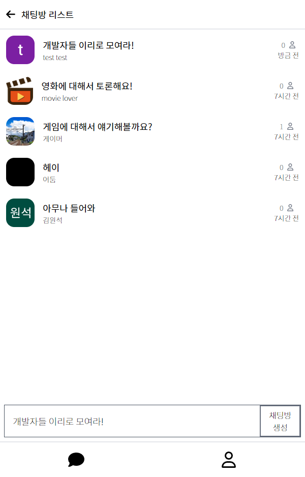
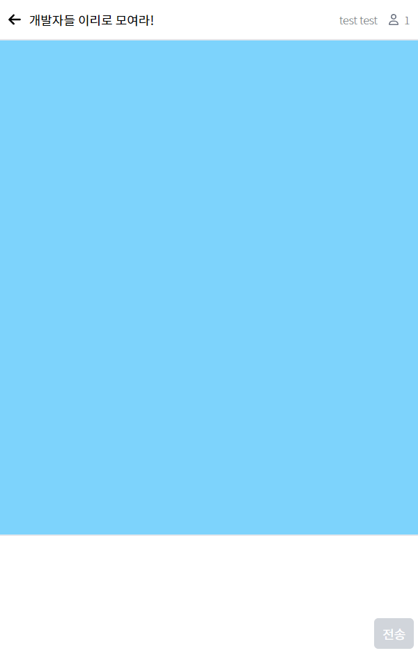
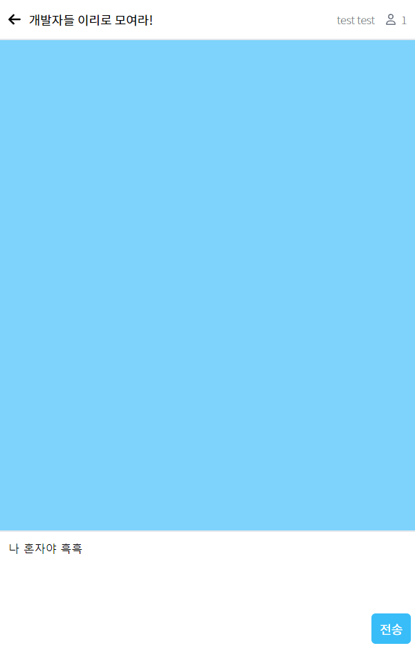
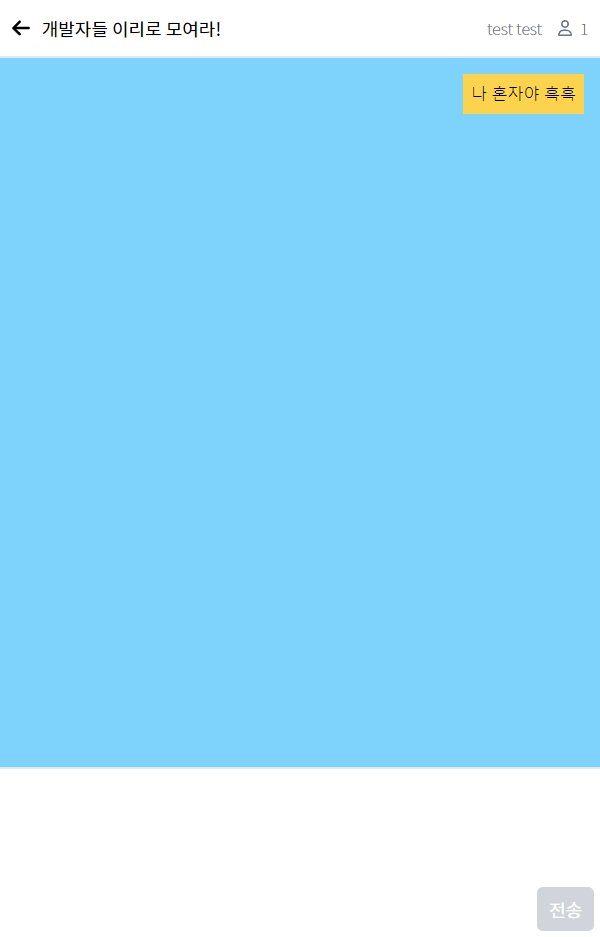
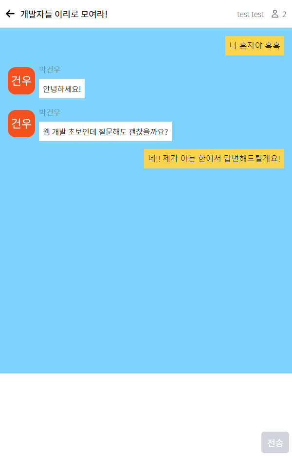

# Socket.io + react + RTK Query + OAuth2.0 을 사용한 프론트엔드
백엔드 : [백엔드 코드로 이동](https://github.com/clcchosun0509/socket.io-chat-app_backend)

[create-react-app](https://www.npmjs.com/package/create-react-app)을 기반으로한 프론트엔드 코드입니다.

백엔드 서버와의 통신은 RTK Query와 Socket.io를 이용합니다.

현재는 구글 OAuth만을 지원하지만 추후에 다른 회사의 OAuth도 추가할 생각입니다.

## 현재 구현된 기능

- 구글 OAuth로 회원가입/로그인
- 채팅방 생성
- 채팅방 접속자 수 확인
- 여러명과 채팅
- 내 프로필 확인
- 로그아웃

## 예제 이미지

&nbsp;

&nbsp;

&nbsp;

